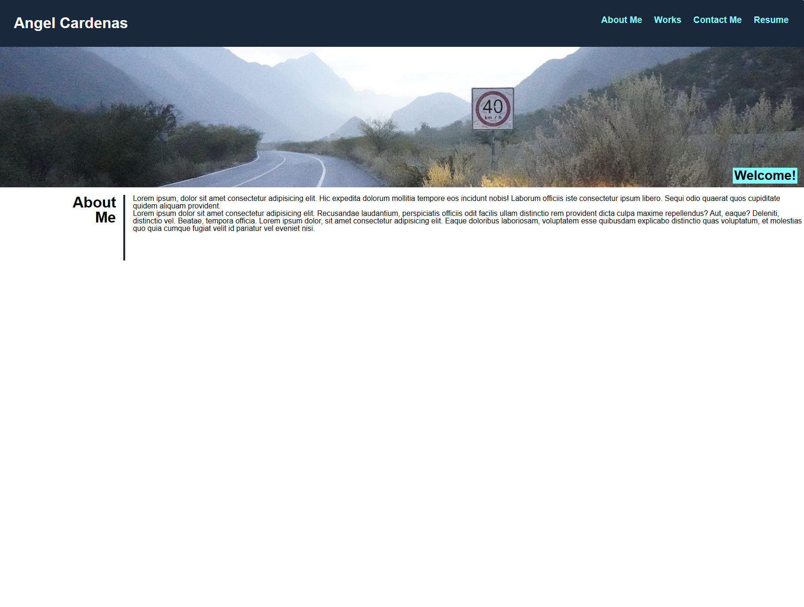
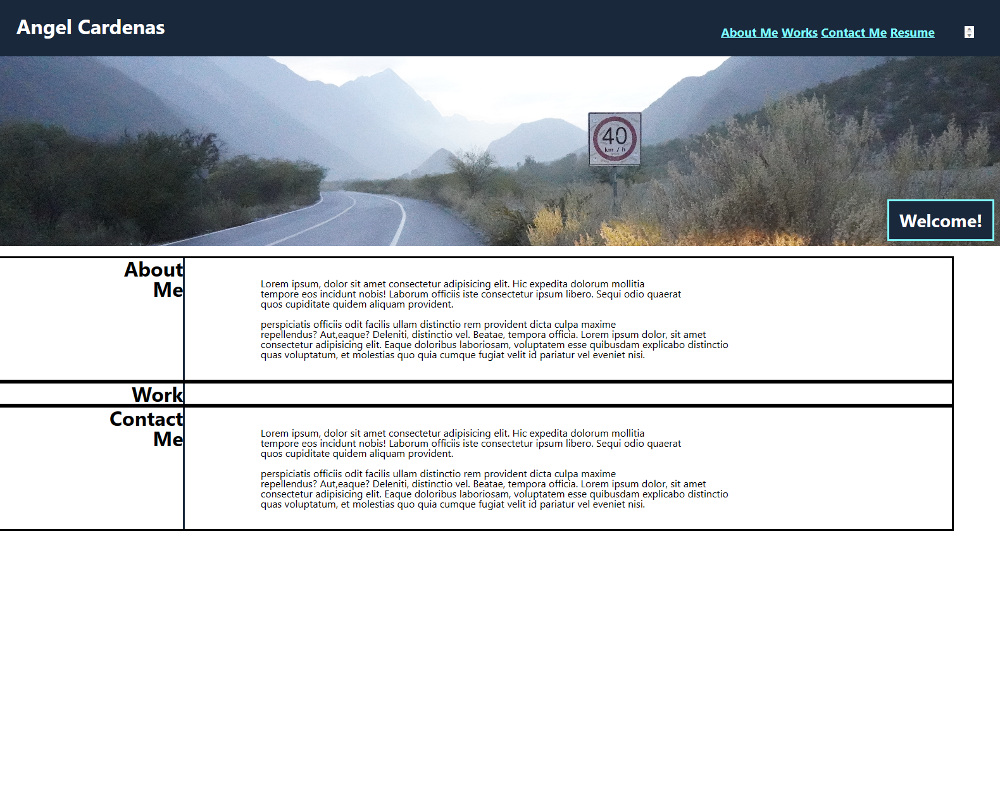

# Wk2-Portfolio-02
Portfolio Website 
## Feature/Assets
Added folders and index.html
## Feature/Code
Added Main structure of the website. + CSS
Added pseudo code to keep track of the code.
Added comments to show original intend.
# Styling/CSS
Added overlay effect to articles,
Debugged an element that was messing with proper layout of the two by two flex elements.
Added media element to flexbox so when the display is less than 776px, the flexbox turn into columns for better display.

# Author Comments:
This portfolio website is faaaar from over. My intent is to keep updating this website for **every two finished app**,
**In the future** I plan to change some things. Maybe try out a grid layout for the **Work** section. 
Overall, This was a real test to my fresh CSS skills. I had fun debugging and rebuilding the enterity of this website (3 times...).

# Screenshots
## First iteration: Feature/code

## Second iteration: Feature/code02

## Third Iteration: Styling/CSS 03

## Third Iterationl: Debugged.

